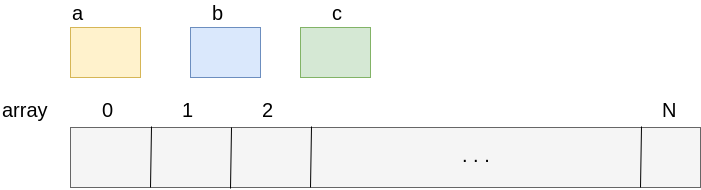
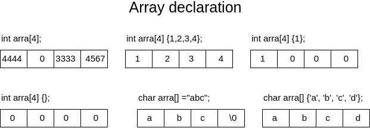
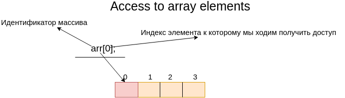
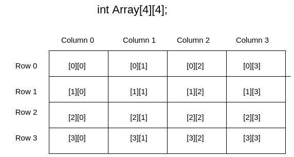
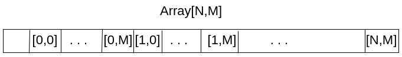

# Tutorial basic concept arrays and pointers
## Arrays
### Array Concept
Масссив это последовательность элементов фиксированого размера одного и того же типа.
Идея массива заключается в том чтобы вместо обявления, например 10 переменных, можно обявить массив с 10 элементов доступ к которым возможен через единый индитификатор. Другим словом массив это колекция переменных одного типа.


- Массивы нужны когда необходимо хранить большое количество данных 
- Все элементы массива расположенны в памяти последовательно, причем самый нижний адресс массива соответсвует первому элементу, а самый высокий адресс - последнему элементу 
- Элементы массива это самостоятельная единица
- Элементы массива должны быть одного типа
- Каждый элемент массива имеет порядковый номер(индекс)
- Индексация массива начинается с нуля (если размер массива, например 5, то диапазон индексов следующий [0..4])
- Доступ к элементу массива за границей массива есть неопределленное поведение (Undefined Behaviour ISO)
- Все массивы должны быть фиксированого размера (ISO)
- Размер массива всегда должен быть больше нуля(т.е. должен быть не пустой колекцией ISO)
### Work with arrays
#### Array declaration
В этом разделе мы расматриваем только массивы которые выделенные на стеке
```cpp
// тип элементов идентификатор[размер массива];
// примеры
int array[2];
float array1[3];

const size_t count_element = 5;
int array2[count_element];

// const int array3[3]; // не компилируется, т.к. при обьявлении константы в C/C++ ее необходимо инициализировать

/* не компилируется
const float array_size = 10.5;
int array_error[array_size];
*/

// double array4[];
```

- Согласно стандарту размер массива должна быть константная величина целочисленного типа(compile time) и быть больше нуля
- При обьявление массива, если не инициализировать элементы, то содержимое элементов массива является неопределенное значение(содержит муссор)

#### Several ways to declare array size
- Обьявление целочисленной константы
```cpp
const size_t array_size = 5;
int array[array_size];
```
- Использовать директиву препроцессора
```cpp
#define ARRAY_SIZE 10
int array[ARRAY_SIZE];
```

- Использовать перечесление
```cpp
enum {
    ARRAY_SIZE = 5
};

int array[ARRAY_SIZE];
```

#### Initializing arrays
Как было сказано ранее массивы по умолчанию инициализированный неопределенным значение, если инициализирующие значения не указать явно. Инициализирующие значения при обьявление массива могут быть списком инициализации (initializer list), или стровыми литералами (string literal).

```cpp
// примеры
int array[2] = {1, 2}; // теперь массив содержит два элемента со значением 1 и 2
float array1[3] {1.2, 2.5, 3.0}; // массив с тремя вещественными числами со значением 1.2, 2.5, 3.0

int array2[4] {}; // массив с цетырьмя целочисленными значениями, где каждый элемент проинициализирован нулями

int array3[3] {1}; // массив с тремя целочисленными значениями, где первый элемент массива проинициализирован 1, а все остальные нулем

int  array4[] {1,2,3} // в этом случае компилятор сам опредилит размер массива изходя из списка инициализации

// int array[] {} // compiler error

const int array[3] {1,2,3}; // инициализация констатного массива, каждый элемент массива только для чтения
/*
// C initializing style
int a[10] = { 0,1,2, [5]=25,26, [9]=100}; // {0,1,2,0,25,26,0,0,100,0}
*/
```
Инициализировать константные массивы можно только во время обьявление масива
Если размер массива который указан в квадратных скобочках меньше размера элементов в списке инициализации то мы получим ошибку компиляции

```cpp
// int array[3] = {1,2,3,4}; // compile error
```

Стоить заметить что массив не несет в себе информации о своем размере, это стоить помнить при обьявления массива с автоматическим выведением размера. Все это справедливо, кроме массивов типа char.

```cpp
char str1[] = "abc"; // размер этого массива 4 элемента, 3 символа + завершающий ноль \0 ( null character)
char str2[3] = "abc"; // размер этого массива 3 элемента
char str3[4] = "abc"; // размер этого массива 4 элемента, 3 символа + завершающий ноль \0 ( null character)
char str4[20] = "abc"; // размер этого массива 20 элемента, 3 первых символа "abc", остальные элементы инициализируються нулем
char str5[] = { 'a', 'b', 'c' }; // размер этого массива 3 элемента
char str6[] = { 'a', 'b', 'c', '\0' }; // размер этого массива 4 элемента, мы явно указали конец строки
char str7[] = { "abc" }; // размер этого массива 4 элемента, 3 символа + завершающий ноль \0
```



В символьных массивах символ заверщающего нуля '\0' указывает на конец строки. При инициализации символьного массива строковым литералом, и если размер массва указан больше или неуказан явно, компилятор добавляет символ завершающего нуля '\0'. Если мы инициализируем строку списком инициализации символов (str5, str6) компилятор не добавляет специальный символ завершающего нуля.
Символ завершающего нуля очень важен при работе с функциями для работы со строками. Используя строковый литерал можно узнать количество элементов массива.

### Access to array elements
- Доступ к элементу массива осуществляется с помощью индекса
- Индекс это целочисленное значение
- Нумерация начинается с нуля и до размер массива минус 1
- Выход за границы массива это неопределенное поведение(граница имеется ввиду как нижня так и верхняя)
- Элементы константного массива только читать, при попытке что то записать мы получим ошибку компиляции
- Индексом может быть как константное значение, переменная, или выражение


```cpp
int array[4] = {1,2,3,4}; // обьявляем массив с четырех элементов

// int undefined_value = array[-1]; // доступ к элементу который находиться перед первым элементом массива
// int undefined_last_value = array[4]; // доступ к элементу который находиться после последнего элемента массива [0..3]
int arr_first_elem = array[1]; // считать с памяти значение которое находиться во втором элементе массива
array[2] = 25; // записать значение 25 в третий элемент массива {1,2,25,4}

// int value_array = array[1.35]; // ошибка компиляции, что неверный тип для индекса массива (double) 

int value_array = array[(int)1.35]; // происходит явное преоразование вещественного в целое

const int read_only_array[2] = {1, 2}; // обьявляем константный целочисленный массив

int const_value = read_only_array[1]; // прочитать значение которое находится во втором элементе массива
// read_only_array[1] = 3; // ошибка компиляции, при записи в read only элемент

char index = 1;
int value = read_only_array[index - 1]; // получение первого элемента массива {1}
```
### Arrays and loops
```cpp
int array[3] = {3,4,5};
int summ += array[0];
summ += array[1];
summ += array[2];

// summ == 12
```
Вместо доступа к каждому элементу массива как в примере выше, используют цыклы для обхода массива
- Цыкл for
```cpp
int array[3] = {1,2,3};
// в этом цыкле мы проходимся по массиву array для этого исользуем целочисленный сячетчик i
// в начале цикла мы инициализируем счетчик 0, и после каждой итерации проверяем не вышли ли мы за границу массива, если нет то
// увеличчиваем счетчик на 1
for (size_t i = 0; i < 3; ++i) {
  printf("%d ", array[i]);
}

// с с++11 появился новый вид Range-based for loop
for (auto value: array) {
  printf("%d ", value);
}

```
- Цыкл while
```cpp
int array[3] = {1,2,3};
// в этом цыкле мы проходимся по массиву array для этого исользуем целочисленный сячетчик i
// вначале мы инициализируем счетчик 0, в цыкле мы проверяем не вышли ли мы за границы массива, если нет то печатаем значение
// элемента и увеличиваем счетчик 
size_t i = 0;
while (i < 3) {
  printf("%d ", array[i++]);
}
```

Обход символьного массива возможен немного другой(в случае если символьный массив заканчивается '\0')
```cpp
char str[] = "abcd";
size_t i = 0;
while (str[i]) {
  printf("%c ", str[i++]);
}

for (i = 0; str[i]; ++i) {
  printf("%c ", str[i]);
}

```

Существует следующая проблема с массива: массивы нельзя присваивать друг-другу даже если они одного типа и размера. Стоит заметить что если попробывать присвоить массивы разных размеров или типов, то получим ошибку несовместимости типов
```cpp
int first_array[3] = {1,2,3};
int second_array[3] = {4,5,6};
 
// first_array = second_array; // compilation error

// first_array = {4,5,6}; // compilation error
// first_array = (int [3]){4,5,6}; // compilation error

int value = 10;
// first_array = value; // compilation error, несовместимые типы int и int[3]
first_array[1] = value; // compile ok
```
Циклы используются также и для присвоедние значений одного массива другому
```cpp
#define SIZE_ARRAY(array) sizeof((array)) / sizeof((array)[0]);
int first_array[3] = {1,2,3};
int second_array[3] = {4,5,6};
size_t count_array_first = SIZE_ARRAY(first_array);
size_t count_array_second = SIZE_ARRAY(second_array);

if (count_array_first <= count_array_second) {
  for (size_t i = 0; i < count_array_first; ++i) {
    first_array[i] = second_array[i];
  }
} else {
  printf("Second array size is smaller than size first array");
}

for (size_t i = 0; i < count_array_first; ++i) {
  printf("%d ", first_array[i]);
}

// Массивы  first_array и second_array теперь одинаковы

```
Есть еще другие подходы для присвоение массивов это memcpy со стандартной библиотеки и структуры
```cpp
struct Array
{
  int array[3] = {1,2,3};
};
//.....
  Array ar1;
  ar1.array[0] = 10;
  ar1.array[1] = 20;
  ar1.array[2] = 30;
  Array ar2 = ar1;

  for (auto value: ar2.array) {
    printf("%d ", value); // print 10 20 30
  }
  printf("\n");
```

### Sizeof Array
Размер массива вычесляется как размер в байтах элемента массива умножено на количество элементов
```
sizeof_in_byte_array_element * count_array_element
```
```cpp
int value = 10;
printf("value size is %uz\n", sizeof(value)); // напечатает 4 байта

int array[5] = {2,3,4,5,6};
printf("int array byte size is %uz\n", sizeof(array)); // напечатает 20 байта

double array_double[5] = {2.2, 3.2, 4.5, 5.6, 6.8};
printf("double array byte size is %uz\n", sizeof(array)); // напечатает 40 байта

```
Для того чтобы получить количество элементов массива, необходимо размер массива в байтах разделить на размер элемента в байтах.
```
size_of_all_element_array_in_bytes / sizeof_array_element_in_byte
```

```cpp
int array[5] = {2,3,4,5,6};
printf("int array size is %uz\n", sizeof(array) / sizeof(array[0])); // напечатает 5

```
Вычесление количество элементов массива необходимо, когда компилятор во время инициализации массива выводит сам размер массива
```cpp
int array[] = {2,3,4,5,6}; // компилятор автоматически вывел размер массива 5
size_t count = sizeof(array) / sizeof(array[0]);
for (size_t i = 0; i < count; ++i ) {
  printf("%d ", array[i]);
}
```
### Multidimensional arrays
До этого мы рассматривали одномерные массивы. В С/C++ можно определять многомерные массивы или другими словами массивы массивов.
- Количество уровней ограниченно только памятью
- Многомерные массивы в основном представляют ввиде таблиц(например количество строк * столбцов)
- Размерность уровней многомерного массива может быть разная(но в основном используют квадратные таблицы, или другими словами матрицы)
- Основное применение многомерных массивов это графика(матрицы поворота, переноса и т.д.), или классические алгоритмы(например представление ввиде таблицы лабиринта, или таблица смежности для графа)
- Размерность первого уровня может быть опциональным, а для всех остальных должен быть явно задан
- Все правила для работы с одномерным массиво, также относятся и многомерным массивам(присваивание, доступ и т.д.)
- Доступ к элементу массива происходит с указанием индекса для каждого уровня



Выше представлен рисунок как вообщем в удобном виде представляют двумерный массив. Но зная что память это линейная величина, то на самом деле в памяти многомерные массивы представлются немного подругом. Т.е. строки представляются в памяти одна за другой. Например первый размер представлен как N, тогда как другой представлен размером M


Из этого вытекает что любой многомерный массив можно представить одномерным массивом

```cpp
  int array[2][2]; // обьявление двумерного массива(содержит неопределенное значение)
  int array1[3][3] = {1,2,3,4,5,6,7,8,9}; // обьявление и инициализация двумерного массива  
  int array2[3][3] = {{1,2,3}, {4,5,6}, {7,8,9}}; // другой вид инициализации масиива
  // int array1D[3] = array1[1]; //ошибка компиляции инициализация массива возможна только списком инициализации
  int array3D[3][3][3] = {
                          {{1,2,3}, {4,5,6}, {7,8,9}},
                          {{10,11,12}, {13,14,15}, {16,17,18}},
                          {{19,20,21}, {22,23,24}, {25,26,27}}
                         }; // инициализация двумерного массива

  int array2D[][3] = {{1,2,3}, {1,2,3}, {1,2,3}};

  // ошибка компиляции, можно опускать указание размера первого уровня, но не всех остальных
  // int array2D_error[][] = {{1,2,3}, {1,2,3}, {1,2,3}};

  int value = array1[1][1]; // доступ ко второму элементу первого уровня, и второго элемента второго уровня
  printf("Midle element array1 is %d\n", value); // print 5

  value = array3D[0][1][2];
  printf("Midle element array3D is %d\n", value); // print 6

  array2[2][2] = 100;

  printf("======= 2D Array =======\n");
  printf("\tColumn 1 \t Column 2 \t Column 3\n");
  for (size_t i = 0; i < 3; ++i) {
    printf("Row %d\t", i + 1);
    for (size_t j = 0; j < 3; ++j) {
      printf("%5d\t\t", array2[i][j]);
    }
    printf("\n");
  }

  // представление многомерного массива одномерным массивом
  int array1D[3 * 3];
  size_t counter = 0;
  for (size_t i = 0; i < 3; ++i) {
    for(size_t j = 0; j < 3; ++j) {
      array1D[i * 3 + j] = ++counter;
    }
  }
  printf("====2D array via 1D array====\n"); 
  for (size_t i = 0; i < 3; ++i) {
    for(size_t j = 0; j < 3; ++j) {
      printf("%2d\t", array1D[i * 3 + j]);
    }
    printf("\n");
  }
```
```
Output
Midle element array1 is 5
Midle element array3D is 6
======= 2D Array =======
	   Column 1 	 Column 2 	 Column 3
Row 1	    1		    2		    3		
Row 2	    4		    5		    6		
Row 3	    7		    8		  100

====2D array via 1D array====
 1	    2	    3	
 4	    5	    6	
 7	    8	    9
```
### Arrays as Parameters
- Массивы в отличие от примитивных типов не передаются по значению
- Размерность массива при передачи как параметра в функцию игрнорируется
- Определение размера массива как в предедущем разделе с помощью sizeof дает не те ожидаимые результаты
- При передачи как параметра в функцию многомерного массива размерность первого уровня игнорируеться как и для одномерных массивов, а вот размер второго уровня необходимо указывать, иначе будет ошибка компиляции
```cpp
#include <stdio.h>

#define SIZE_ARRAY(array) sizeof((array)) / sizeof((array)[0])

void incorrect_print_array(int array[5]/*the same int array[]*/) {
  // результат будет не такой как ожидается(см. раздел с указателями)
  printf("array size in incorrect function %zu\n", SIZE_ARRAY(array));
  for (size_t i = 0; i < 5; ++i) {
    printf("%d ", array[i]);
  }
  printf("\n");
}

void correct_print_array(int array[], size_t length) {
  for (size_t i = 0; i < length; ++i) {
    printf("%d ", array[i]);
  }
  printf("\n");
}

void buble_sort(int (&array)[5]) {
  for (size_t i = 0; i < 5; ++i) {
    for (size_t j = 0; j < 5 -1; ++j) {
        if (array[j] > array[j + 1]) {
          int tmp = array[j];
          array[j] = array[j + 1];
          array[j + 1] = tmp;
        }
    }
  }
}

// при передачи многомерного массива первый уровень игнорируеться компилятором как при работе с одномерным массивом
// а вот размер второго уровня обьязателен, если его указать или передать неверный размер то будет ошибка компиляции
void print_2D_array(int array[][2], size_t length_first_dim) {
  for (size_t i = 0; i < length_first_dim; ++i) {
    for (size_t j = 0; j < 2; ++j) {
      printf("%5d", array[i][j]);
    }
    printf("\n");
  }
}

int main(void) {
  int array[5] = {5, 4, 3, 2, 1};
  int array2[7] = {7, 6, 5, 4, 3, 2, 1};
  printf("array size is %zu\n", SIZE_ARRAY(array));
  buble_sort(array);
  // buble_sort(array2); compiler error initialization of reference of type ‘int (&)[5]’ from expression of type ‘int [7]’

  incorrect_print_array(array); // print 1 2 3 4 5
  // программа компилируеться без ошибок, так как по умолчанию размер массива игнорируеться
  incorrect_print_array(array2); // print 7 6 5 4 3

  correct_print_array(array2, SIZE_ARRAY(array2)); // print 7 6 5 4 3 2 1

  int array2D[][2] = {{1,2}, {3,4}, {5,6}};
  print_2D_array(array2D, SIZE_ARRAY(array2D));
  // int array2D_error[][3] = {{1,2,3}, {4,5,6}, {7,8,9}};
  // print_2D_array(array2D_error, SIZE_ARRAY(array2D_error)); // compilation error, несовместимость типов(размеров)
  return 0;
}
```

## Pointers